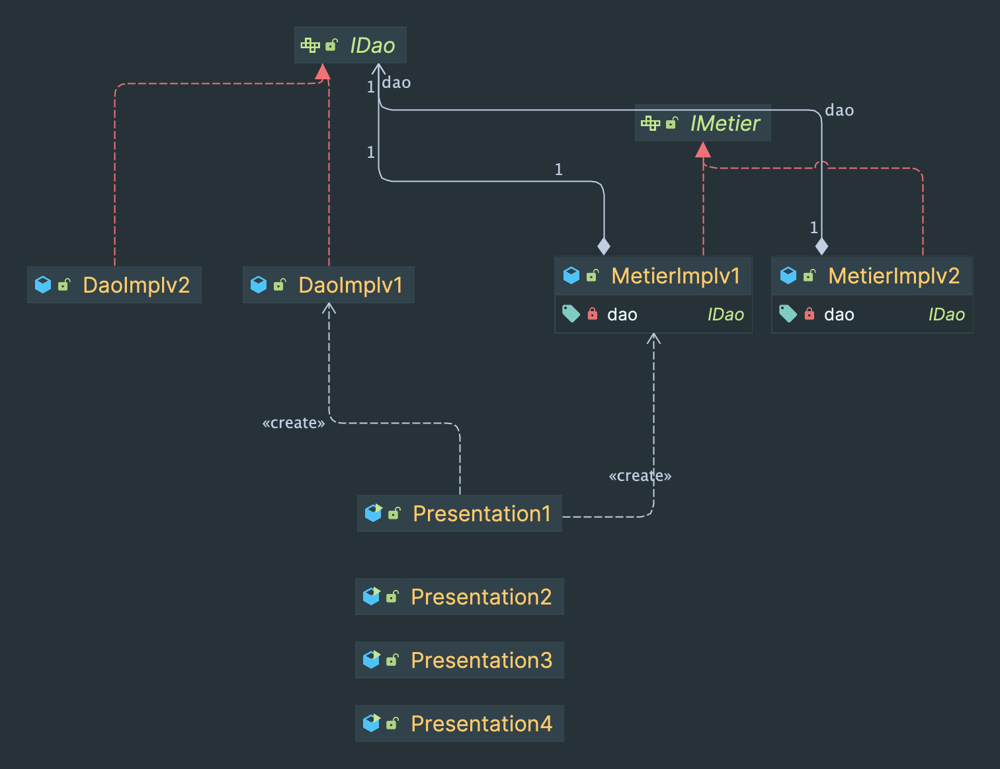

## Activité Pratique N° 1 - Inversion de Contrôle et Injection des dépendances

### Class Diagram :

The diagram illustrates a basic structure with classes and interfaces.

### Classes and Interfaces

- **DaoImplv1**: Implementation of the DAO class with a constructor and a `double` data attribute.
- **DaoImplv2**: Another implementation of the DAO class with a constructor and a `double` data attribute.
- **IDao (Interface)**: Interface representing the DAO with a `double` data attribute.
- **MetierImplv1**: Implementation of the Metier class that takes an `IDao` instance in the constructor.
- **MetierImplv2**: Another implementation of the Metier class that also takes an `IDao` instance in the constructor.
- **Presentation1 to Presentation4**: Simple presentation classes with constructors.
